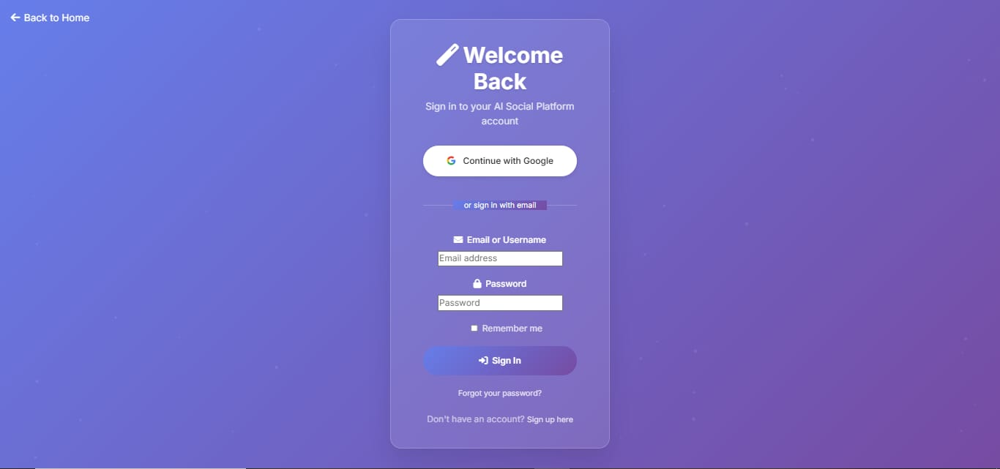
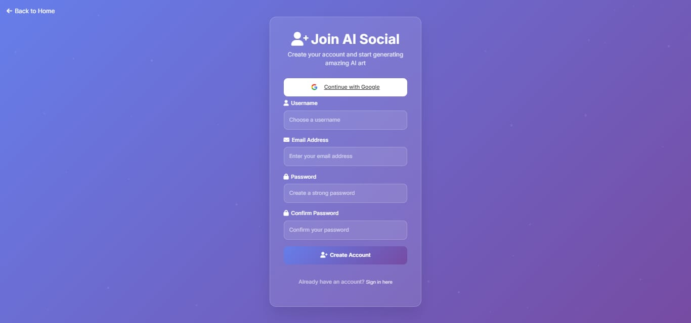
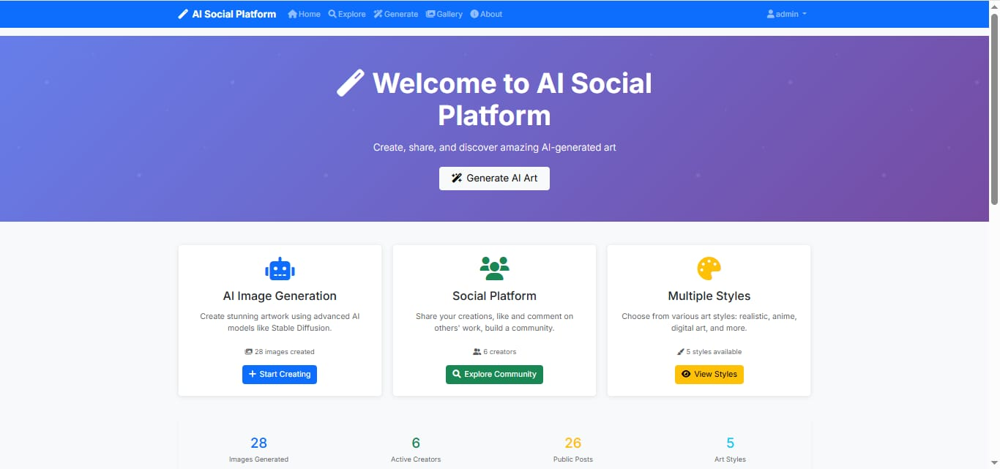

# 🎨 Social Media Post Generator

A simple **Social Media Post Generator** built as a college project.  
Users can enter input text, and the app generates an image post with options to **download** or **share** directly on popular platforms like **Instagram, WhatsApp, Telegram, etc.**

---

## ✨ Features
- 📝 User gives input text
- 🎨 Auto-generate social media post image
- 💾 Download option for generated image
- 📤 Share option for WhatsApp, Instagram, Telegram, etc.
- 🖼️ Clean UI with screenshots
### 🔑 Login Page

### 📝 Signup Page

### 🏠 Home Page

